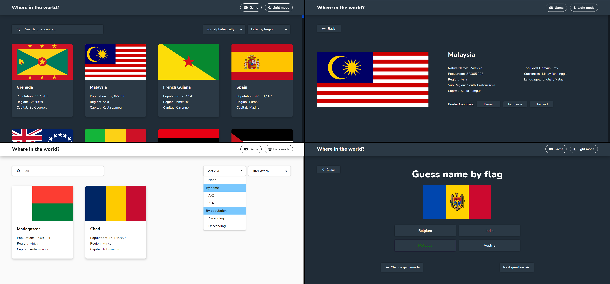

# Frontend Mentor - REST Countries API with color theme switcher solution

This is a solution to the [REST Countries API with color theme switcher challenge on Frontend Mentor](https://www.frontendmentor.io/challenges/rest-countries-api-with-color-theme-switcher-5cacc469fec04111f7b848ca). Frontend Mentor challenges help you improve your coding skills by building realistic projects. 

My addition is sorting coutries by name or population and guessing game that allows user guess names, flags and capital

## Table of contents

- [Overview](#overview)
  - [The challenge](#the-challenge)
  - [Screenshot](#screenshot)
  - [Links](#links)
  - [Built with](#built-with)
- [Author](#author)

## Overview

### The challenge

Users should be able to:

- See all countries from the API on the homepage
- Search for a country using an `input` field
- Filter countries by region
- Click on a country to see more detailed information on a separate page
- Click through to the border countries on the detail page
- Toggle the color scheme between light and dark mode *(optional)*

Additions:
- Sorting by name or population
- Countries guessing game (names, flags, capital)

### Screenshot

### Links

- Solution URL: [https://github.com/Pasek108/WhereInTheWorld/](https://github.com/Pasek108/WhereInTheWorld/)
- Live Site URL: [https://pasek108.github.io/WhereInTheWorld/](https://pasek108.github.io/WhereInTheWorld/)

### Built with

- HTML5
- LESS
- JS (ECMAScript 2018)

## Author

- Website - [Artur Pas](https://pas-artur.000webhostapp.com)
- Frontend Mentor - [@Pasek108](https://www.frontendmentor.io/profile/Pasek108)
